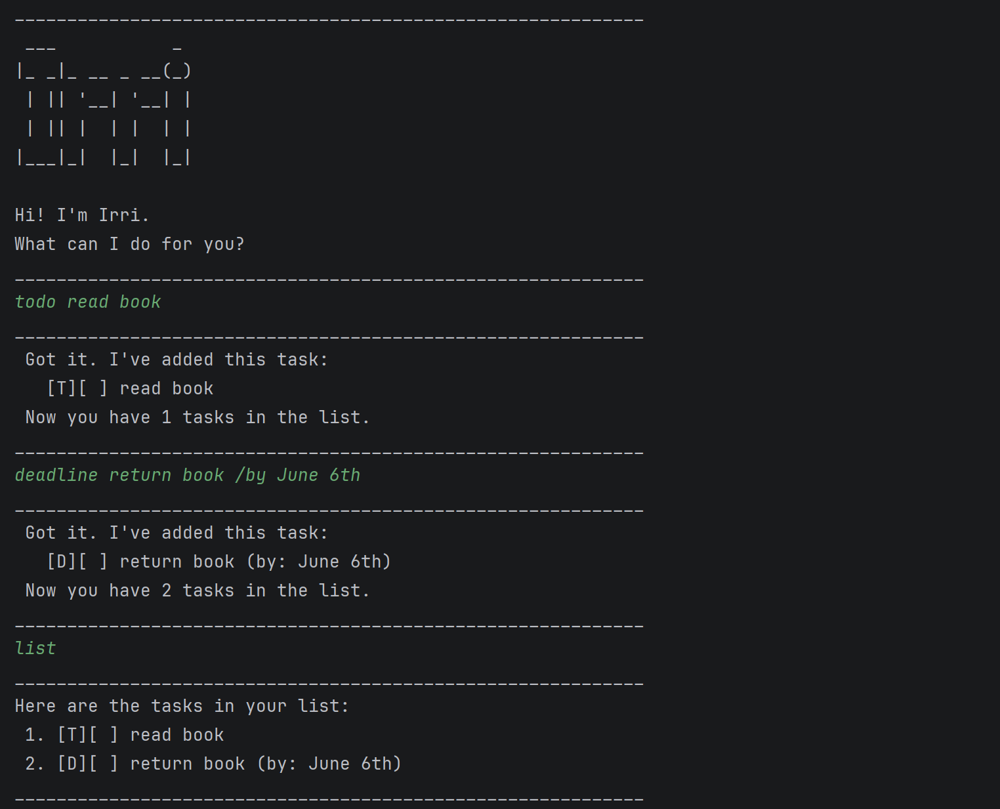

# Irri User Guide



Irri is a **desktop chatbot** for managing your tasks, optimized for use via a Command Line Interface (CLI).
It supports todos, deadlines, and events, and saves your tasks automatically.

## Adding a todo: `todo`

Adds a task without any date/time attached.

**Example:** `todo read book`

**Expected output:**

```
Got it. I've added this task:
[T][ ] read book
Now you have 1 tasks in the list.
```
---

## Adding a deadline: `deadline`
Adds a task that needs to be done before a specific date/time.

**Example:** `deadline return book /by June 6th`

**Expected output:**

```
Got it. I've added this task:
[D][ ] return book (by: June 6th)
Now you have 2 tasks in the list.
```
---

## Adding an event: `event`

Adds a task that starts and ends at a specific date/time.

**Example:** `event project meeting /from 2pm /to 4pm`

**Expected output:**

```
Got it. I've added this task:
[E][ ] project meeting (from: 2pm to: 4pm)
Now you have 3 tasks in the list.
```

---

## Listing all tasks: `list`

Shows all tasks in the list.

**Example:** `list`

**Expected output:**

```
Here are the tasks in your list:
1.[T][ ] read book
2.[D][ ] return book (by: June 6th)
3.[E][ ] project meeting (from: 2pm to: 4pm)
```

---

## Marking a task as done: `mark`

Marks the specified task as completed.

**Example:** `mark 1`

**Expected output:**

```
Nice! I've marked this task as done:
[T][X] read book
```

---

## Marking a task as not done: `unmark`

Marks the specified task as not completed.

**Example:** `unmark 1`

**Expected output:**

```
OK, I've marked this task as not done yet:
[T][ ] read book
```

---

## Deleting a task: `delete`

Removes the specified task from the list.

**Example:** `delete 3`

**Expected output:**

```
OK. I've removed this task:
[E][ ] project meeting (from: 2pm to: 4pm)
Now you have 2 tasks in the list.
```

---

## Finding tasks by keyword: `find`

Finds tasks whose descriptions contain the given keyword (case-insensitive).

**Example:** `find book`

**Expected output:**

```
Here are the matching tasks in your list:
1.[T][ ] read book
2.[D][ ] return book (by: June 6th)
```

---

## Exiting the program: `bye`

Exits the chatbot.

**Example:** `bye`

**Expected output:**

```
Bye. See you!
```

---

## Saving the data

Task data is saved automatically to `data/irri.txt` after any command that changes the task list. There is no need to save manually.

---